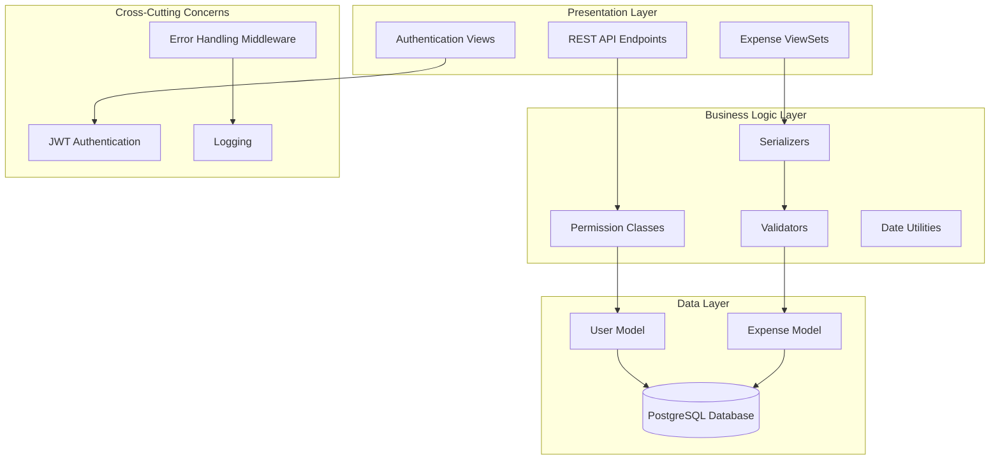
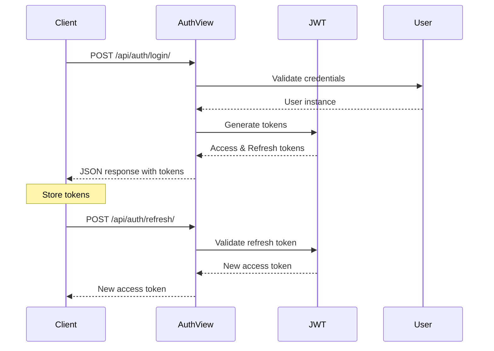
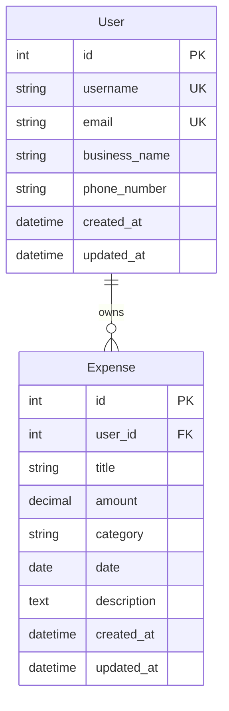

# Design Document: Vyapar Margadarshan Django Backend

## Overview

The Vyapar Margadarshan Django backend is a REST API system designed to provide secure financial management capabilities for small and medium enterprises. The system implements a three-phase modular architecture with JWT-based authentication, comprehensive expense tracking, and localization support for the Nepalese market.

The backend follows Django best practices with clear separation of concerns across three main applications: users (identity & security), expenses (transaction engine), and core (utilities & localization). The system prioritizes data security through user-isolated querysets, precise financial calculations using DecimalField, and comprehensive error handling.

## Architecture

### System Architecture

The system follows a layered architecture pattern with clear separation between presentation, business logic, and data layers:



### Django Project Structure

```
vyapar_margadarshan/
├── manage.py
├── vyapar_margadarshan/
│   ├── __init__.py
│   ├── settings/
│   │   ├── __init__.py
│   │   ├── base.py
│   │   ├── development.py
│   │   └── production.py
│   ├── urls.py
│   └── wsgi.py
├── apps/
│   ├── users/
│   │   ├── __init__.py
│   │   ├── models.py
│   │   ├── serializers.py
│   │   ├── views.py
│   │   ├── urls.py
│   │   └── migrations/
│   ├── expenses/
│   │   ├── __init__.py
│   │   ├── models.py
│   │   ├── serializers.py
│   │   ├── views.py
│   │   ├── urls.py
│   │   └── migrations/
│   └── core/
│       ├── __init__.py
│       ├── middleware.py
│       ├── utils.py
│       ├── exceptions.py
│       └── date_helpers.py
└── requirements/
    ├── base.txt
    ├── development.txt
    └── production.txt
```

### Application Responsibilities

**Users App (Phase 1: Identity & Security)**
- Custom User model extending AbstractUser
- JWT authentication implementation
- User registration and login endpoints
- Token refresh functionality

**Expenses App (Phase 2: Transaction Engine)**
- Expense model with user relationships
- CRUD operations for financial transactions
- User-filtered querysets for data isolation
- Category-based expense classification

**Core App (Phase 3: Utility & Localization)**
- Global error handling middleware
- Date conversion utilities (BS/AD calendars)
- Shared utilities and helper functions
- Cross-app exception handling

## Components and Interfaces

### Authentication System

**JWT Token Flow:**


**Authentication Components:**

1. **Custom User Model**
   ```python
   class User(AbstractUser):
       # Additional fields for business context
       business_name = models.CharField(max_length=255, blank=True)
       phone_number = models.CharField(max_length=15, blank=True)
   ```

2. **Authentication Views**
   - Login view using TokenObtainPairView
   - Token refresh view using TokenRefreshView
   - Custom serializers for additional user fields

3. **Permission Classes**
   - IsAuthenticated for all protected endpoints
   - Custom permissions for user-specific data access

### Expense Management System

**Expense Model Design:**
```python
class Expense(models.Model):
    CATEGORY_CHOICES = [
        ('FOOD', 'Food'),
        ('RENT', 'Rent'),
        ('SALARY', 'Salary'),
        ('SUPPLIES', 'Supplies'),
        ('OTHER', 'Other'),
    ]
    
    user = models.ForeignKey(User, on_delete=models.CASCADE)
    title = models.CharField(max_length=255)
    amount = models.DecimalField(max_digits=12, decimal_places=2)
    category = models.CharField(max_length=20, choices=CATEGORY_CHOICES)
    date = models.DateField()
    created_at = models.DateTimeField(auto_now_add=True)
    updated_at = models.DateTimeField(auto_now=True)
```

**ViewSet Implementation:**
- ModelViewSet for full CRUD operations
- User-filtered querysets: `queryset.filter(user=request.user)`
- Custom serializers with validation
- Proper HTTP status codes for all operations

### Core Utilities System

**Error Handling Middleware:**
```python
class GlobalErrorHandlingMiddleware:
    def __init__(self, get_response):
        self.get_response = get_response
    
    def __call__(self, request):
        try:
            response = self.get_response(request)
        except Exception as e:
            return self.handle_exception(e)
        return response
```

**Date Conversion Utilities:**
- BS to AD calendar conversion functions
- AD to BS calendar conversion functions
- Date validation and error handling
- Utility functions accessible across all apps

## Data Models

### User Model

```python
from django.contrib.auth.models import AbstractUser
from django.db import models

class User(AbstractUser):
    business_name = models.CharField(
        max_length=255, 
        blank=True,
        help_text="Name of the business"
    )
    phone_number = models.CharField(
        max_length=15, 
        blank=True,
        help_text="Contact phone number"
    )
    created_at = models.DateTimeField(auto_now_add=True)
    updated_at = models.DateTimeField(auto_now=True)
    
    class Meta:
        db_table = 'users_user'
        verbose_name = 'User'
        verbose_name_plural = 'Users'
```

### Expense Model

```python
from django.db import models
from django.contrib.auth import get_user_model
from decimal import Decimal

User = get_user_model()

class Expense(models.Model):
    CATEGORY_CHOICES = [
        ('FOOD', 'Food'),
        ('RENT', 'Rent'),
        ('SALARY', 'Salary'),
        ('SUPPLIES', 'Supplies'),
        ('OTHER', 'Other'),
    ]
    
    user = models.ForeignKey(
        User, 
        on_delete=models.CASCADE,
        related_name='expenses'
    )
    title = models.CharField(max_length=255)
    amount = models.DecimalField(
        max_digits=12, 
        decimal_places=2,
        help_text="Amount in local currency"
    )
    category = models.CharField(
        max_length=20, 
        choices=CATEGORY_CHOICES,
        default='OTHER'
    )
    date = models.DateField()
    description = models.TextField(blank=True)
    created_at = models.DateTimeField(auto_now_add=True)
    updated_at = models.DateTimeField(auto_now=True)
    
    class Meta:
        db_table = 'expenses_expense'
        ordering = ['-date', '-created_at']
        indexes = [
            models.Index(fields=['user', 'date']),
            models.Index(fields=['user', 'category']),
        ]
    
    def clean(self):
        if self.amount <= Decimal('0'):
            raise ValidationError('Amount must be positive')
```

### Database Relationships



## API Endpoint Design

### Authentication Endpoints

**POST /api/auth/login/**
```json
Request:
{
    "username": "business_owner",
    "password": "secure_password"
}

Response:
{
    "access": "eyJ0eXAiOiJKV1QiLCJhbGciOiJIUzI1NiJ9...",
    "refresh": "eyJ0eXAiOiJKV1QiLCJhbGciOiJIUzI1NiJ9..."
}
```

**POST /api/auth/refresh/**
```json
Request:
{
    "refresh": "eyJ0eXAiOiJKV1QiLCJhbGciOiJIUzI1NiJ9..."
}

Response:
{
    "access": "eyJ0eXAiOiJKV1QiLCJhbGciOiJIUzI1NiJ9..."
}
```

### Expense Management Endpoints

**GET /api/expenses/**
- Returns paginated list of user's expenses
- Supports filtering by category and date range
- Requires authentication

**POST /api/expenses/**
```json
Request:
{
    "title": "Office Supplies",
    "amount": "150.75",
    "category": "SUPPLIES",
    "date": "2024-01-15",
    "description": "Stationery and printer paper"
}

Response:
{
    "id": 1,
    "title": "Office Supplies",
    "amount": "150.75",
    "category": "SUPPLIES",
    "date": "2024-01-15",
    "description": "Stationery and printer paper",
    "created_at": "2024-01-15T10:30:00Z",
    "updated_at": "2024-01-15T10:30:00Z"
}
```

**GET /api/expenses/{id}/**
- Returns specific expense details
- Only accessible by expense owner

**PUT /api/expenses/{id}/**
- Updates expense record
- Only accessible by expense owner

**DELETE /api/expenses/{id}/**
- Deletes expense record
- Only accessible by expense owner

### URL Configuration

```python
# Main URLs
urlpatterns = [
    path('admin/', admin.site.urls),
    path('api/auth/', include('apps.users.urls')),
    path('api/', include('apps.expenses.urls')),
]

# Users app URLs
urlpatterns = [
    path('login/', TokenObtainPairView.as_view(), name='token_obtain_pair'),
    path('refresh/', TokenRefreshView.as_view(), name='token_refresh'),
]

# Expenses app URLs
router = DefaultRouter()
router.register(r'expenses', ExpenseViewSet)
urlpatterns = router.urls
```
## Correctness Properties

*A property is a characteristic or behavior that should hold true across all valid executions of a system-essentially, a formal statement about what the system should do. Properties serve as the bridge between human-readable specifications and machine-verifiable correctness guarantees.*

### Property 1: Authentication Token Generation

*For any* valid user credentials, the authentication endpoint should return both access and refresh tokens in JSON format.

**Validates: Requirements 1.2, 1.5**

### Property 2: Token Refresh Functionality

*For any* valid refresh token, the refresh endpoint should generate and return a new access token.

**Validates: Requirements 1.3**

### Property 3: Authentication Requirement Enforcement

*For any* protected API endpoint, requests without valid authentication should be rejected with HTTP 401 Unauthorized status.

**Validates: Requirements 2.1, 2.4**

### Property 4: User Data Isolation

*For any* authenticated user, querying expense data should return only records associated with that specific user, never exposing other users' data.

**Validates: Requirements 2.2, 3.6**

### Property 5: Expense Record Completeness

*For any* expense creation request, the system should store all required fields (user, title, amount, category, date) and associate the record with the authenticated user.

**Validates: Requirements 3.1, 3.5**

### Property 6: Decimal Amount Precision

*For any* monetary amount, the system should store and retrieve decimal values with exact precision and reject non-positive amounts.

**Validates: Requirements 3.2, 8.2**

### Property 7: Category Validation

*For any* expense submission, the system should accept only predefined categories (Food, Rent, Salary, Supplies, Other) and reject invalid category values.

**Validates: Requirements 3.3, 8.3**

### Property 8: CRUD Operations Completeness

*For any* expense record, the system should support create, read, update, and delete operations with proper user authorization.

**Validates: Requirements 3.4**

### Property 9: RESTful Endpoint Behavior

*For any* API endpoint, the system should follow RESTful conventions with appropriate HTTP methods and return consistent JSON response formats.

**Validates: Requirements 4.4, 4.5**

### Property 10: Standardized Error Responses

*For any* error condition (validation errors, system errors, authentication failures), the system should return standardized JSON error responses with descriptive messages and appropriate HTTP status codes.

**Validates: Requirements 5.2, 5.4, 5.5, 8.5**

### Property 11: Error Logging

*For any* system error, the error should be logged appropriately with sufficient detail for debugging purposes.

**Validates: Requirements 5.3**

### Property 12: Date Conversion Accuracy

*For any* valid date, conversion between BS (Bikram Sambat) and AD (Anno Domini) calendar systems should produce mathematically correct results.

**Validates: Requirements 6.2**

### Property 13: Date Conversion Error Handling

*For any* invalid date input to conversion functions, the system should handle errors gracefully without crashing.

**Validates: Requirements 6.4**

### Property 14: Data Validation Enforcement

*For any* expense submission with missing mandatory fields, the system should reject the request and return descriptive validation errors.

**Validates: Requirements 8.1, 8.4**

## Error Handling

### Error Handling Architecture

The system implements a comprehensive error handling strategy using Django middleware and custom exception classes:

```python
# core/middleware.py
class GlobalErrorHandlingMiddleware:
    def __init__(self, get_response):
        self.get_response = get_response
    
    def __call__(self, request):
        try:
            response = self.get_response(request)
        except ValidationError as e:
            return self.handle_validation_error(e)
        except PermissionDenied as e:
            return self.handle_permission_error(e)
        except Exception as e:
            return self.handle_system_error(e)
        return response
```

### Error Response Format

All errors follow a standardized JSON format:

```json
{
    "error": {
        "code": "VALIDATION_ERROR",
        "message": "Invalid input data",
        "details": {
            "amount": ["This field must be a positive number"],
            "category": ["Select a valid choice"]
        },
        "timestamp": "2024-01-15T10:30:00Z"
    }
}
```

### Error Categories

1. **Authentication Errors (401)**
   - Invalid credentials
   - Expired tokens
   - Missing authentication

2. **Authorization Errors (403)**
   - Insufficient permissions
   - Access to other users' data

3. **Validation Errors (400)**
   - Invalid input data
   - Missing required fields
   - Format violations

4. **Not Found Errors (404)**
   - Non-existent resources
   - Invalid endpoints

5. **System Errors (500)**
   - Database connection issues
   - Unexpected exceptions
   - Service unavailability

### Logging Strategy

```python
import logging

logger = logging.getLogger(__name__)

# Error levels and contexts
logger.error(f"Authentication failed for user: {username}")
logger.warning(f"Invalid expense category attempted: {category}")
logger.info(f"User {user_id} created expense {expense_id}")
logger.debug(f"Date conversion: {bs_date} -> {ad_date}")
```

## Testing Strategy

### Dual Testing Approach

The system employs both unit testing and property-based testing for comprehensive coverage:

**Unit Tests:**
- Specific examples and edge cases
- Integration points between Django apps
- Authentication flow scenarios
- Error condition handling
- Database model constraints

**Property-Based Tests:**
- Universal properties across all inputs
- Comprehensive input coverage through randomization
- Data validation rules
- API behavior consistency
- Security property verification

### Property-Based Testing Implementation

Using **Hypothesis** for Python property-based testing with minimum 100 iterations per test:

```python
from hypothesis import given, strategies as st
from hypothesis.extra.django import TestCase

class ExpensePropertyTests(TestCase):
    
    @given(st.decimals(min_value=0.01, max_value=999999.99, places=2))
    def test_decimal_precision_property(self, amount):
        """Feature: vyapar-margadarshan-backend, Property 6: Decimal Amount Precision"""
        # Test that decimal amounts maintain precision
        
    @given(st.text(min_size=1, max_size=255))
    def test_user_data_isolation_property(self, expense_title):
        """Feature: vyapar-margadarshan-backend, Property 4: User Data Isolation"""
        # Test that users only see their own data
```

### Unit Testing Focus Areas

1. **Authentication Integration**
   - Login endpoint with valid/invalid credentials
   - Token refresh with expired tokens
   - Protected endpoint access patterns

2. **Expense Management**
   - CRUD operations with various data combinations
   - Category validation with boundary cases
   - Date handling with different formats

3. **Error Handling**
   - Middleware exception processing
   - Custom error response formatting
   - Logging output verification

4. **Date Conversion**
   - BS/AD calendar conversion accuracy
   - Edge cases (leap years, month boundaries)
   - Invalid date input handling

### Test Configuration

- **Minimum 100 iterations** for each property-based test
- **Test database isolation** for each test case
- **Mock external dependencies** (if any)
- **Coverage target**: 90%+ for critical business logic
- **Performance benchmarks** for API response times

### Testing Tools

- **Django TestCase** for unit tests
- **Hypothesis** for property-based testing
- **Django REST Framework test client** for API testing
- **Factory Boy** for test data generation
- **Coverage.py** for test coverage analysis

The testing strategy ensures that both specific scenarios (unit tests) and general system properties (property-based tests) are thoroughly validated, providing confidence in system correctness and reliability.