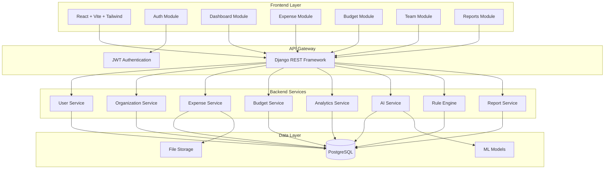
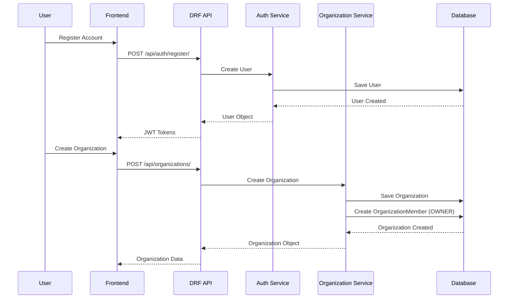
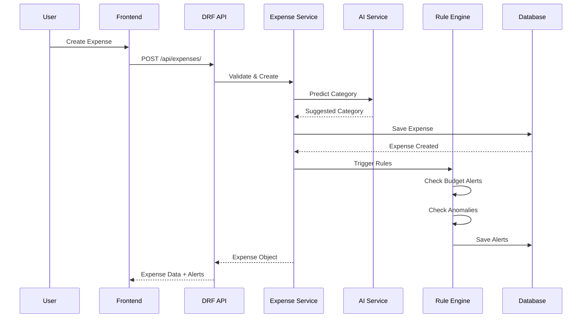
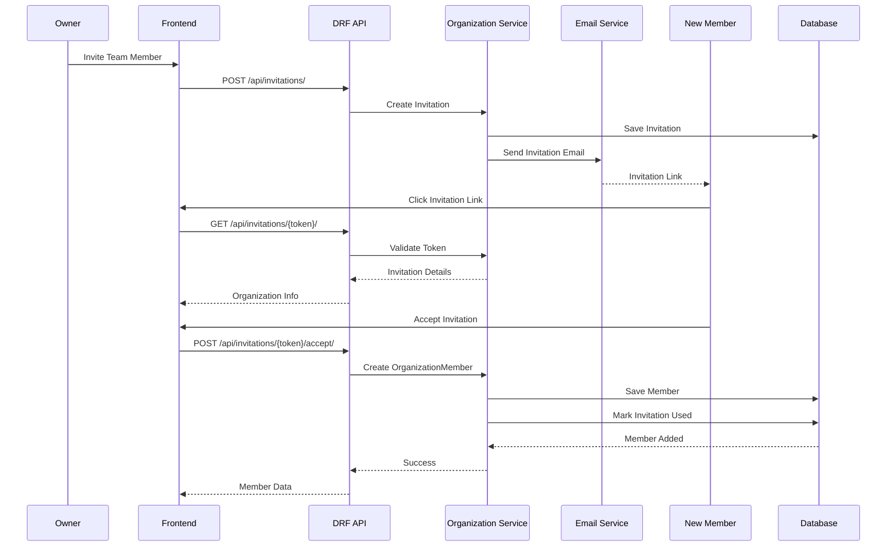
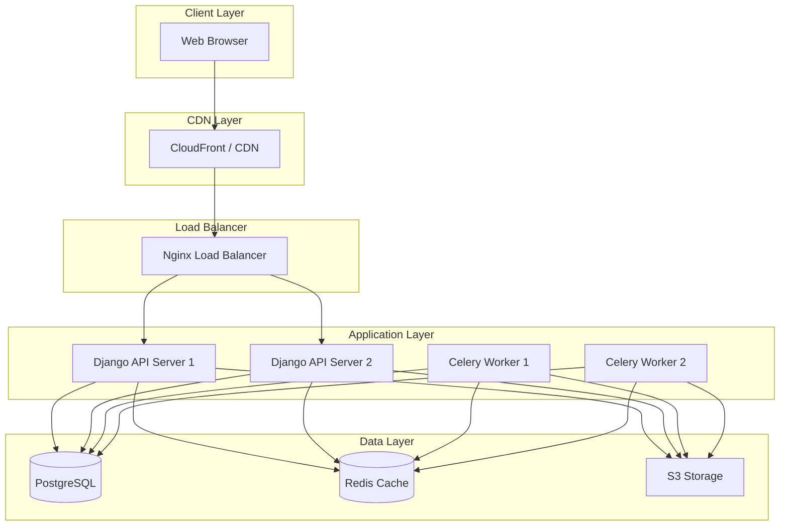

# Design Document: Vyapar Margadarshan - Complete SME Financial Management System

## Overview

Vyapar Margadarshan is a 
 financial management system designed specifically for Small and Medium Enterprises (SMEs) in Nepal. The system provides multi-user organization management, expense tracking, budget management, AI-powered insights, and team collaboration features. Built with Django REST Framework backend and React frontend, it supports role-based access control with three user roles (OWNER, MANAGER, STAFF) and includes Nepal-specific features like BS/AD date conversion.

The system architecture follows a modern microservices-inspired approach with clear separation between authentication, organization management, expense tracking, analytics, AI features, and reporting modules. It leverages machine learning for smart categorization and anomaly detection, while maintaining a rule-based engine for budget alerts and compliance monitoring.

## Architecture



## Main Workflow Sequence Diagrams

### User Registration and Organization Setup



### Expense Creation with AI Categorization



### Team Member Invitation Flow



## Components and Interfaces

### Component 1: Authentication Service

**Purpose**: Handle user registration, login, JWT token management, and role-based access control.

**Interface**:
```python
class AuthenticationService:
    def register_user(self, username: str, email: str, password: str, 
                     business_name: str = None) -> User:
        """Register a new user account"""
        pass
    
    def authenticate_user(self, username: str, password: str) -> dict:
        """Authenticate user and return JWT tokens"""
        pass
    
    def refresh_token(self, refresh_token: str) -> dict:
        """Refresh access token using refresh token"""
        pass
    
    def verify_token(self, token: str) -> User:
        """Verify JWT token and return user"""
        pass
```

**Responsibilities**:
- User registration with validation
- Password hashing and verification
- JWT token generation and validation
- Token refresh mechanism
- User session management

### Component 2: Organization Service

**Purpose**: Manage organizations, team members, invitations, and role-based permissions.

**Interface**:
```python
class OrganizationService:
    def create_organization(self, owner: User, name: str, 
                          description: str = None) -> Organization:
        """Create new organization with owner"""
        pass
    
    def invite_member(self, organization: Organization, inviter: User,
                     email: str, role: str) -> Invitation:
        """Create invitation for new team member"""
        pass
    
    def accept_invitation(self, token: str, user: User) -> OrganizationMember:
        """Accept invitation and add user to organization"""
        pass
    
    def update_member_role(self, organization: Organization, member: User,
                          new_role: str, updater: User) -> OrganizationMember:
        """Update team member role (requires OWNER permission)"""
        pass
    
    def remove_member(self, organization: Organization, member: User,
                     remover: User) -> bool:
        """Remove team member from organization"""
        pass
    
    def check_permission(self, user: User, organization: Organization,
                        permission: str) -> bool:
        """Check if user has specific permission in organization"""
        pass
```

**Responsibilities**:
- Organization CRUD operations
- Team member management
- Invitation system with email notifications
- Role-based permission checking
- Organization data isolation

### Component 3: Expense Service

**Purpose**: Manage expense records with CRUD operations, approval workflows, and file attachments.

**Interface**:
```python
class ExpenseService:
    def create_expense(self, user: User, organization: Organization,
                      title: str, amount: Decimal, category: str,
                      date: date, description: str = None,
                      receipt: File = None) -> Expense:
        """Create new expense record"""
        pass
    
    def update_expense(self, expense: Expense, user: User,
                      **kwargs) -> Expense:
        """Update expense record"""
        pass
    
    def delete_expense(self, expense: Expense, user: User) -> bool:
        """Delete expense record"""
        pass
    
    def submit_for_approval(self, expense: Expense, user: User) -> Expense:
        """Submit expense for manager approval (STAFF only)"""
        pass
    
    def approve_expense(self, expense: Expense, approver: User) -> Expense:
        """Approve expense (MANAGER/OWNER only)"""
        pass
    
    def reject_expense(self, expense: Expense, approver: User,
                      reason: str) -> Expense:
        """Reject expense with reason"""
        pass
    
    def attach_receipt(self, expense: Expense, receipt: File) -> Expense:
        """Attach receipt file to expense"""
        pass
```

**Responsibilities**:
- Expense CRUD operations
- Approval workflow management
- Receipt file handling
- Organization-level data isolation
- Permission-based access control

### Component 4: Budget Service

**Purpose**: Manage budgets, track spending against budgets, and generate alerts.

**Interface**:
```python
class BudgetService:
    def create_budget(self, organization: Organization, category: str,
                     amount: Decimal, period_start: date, period_end: date,
                     created_by: User) -> Budget:
        """Create budget for category and time period"""
        pass
    
    def update_budget(self, budget: Budget, user: User, **kwargs) -> Budget:
        """Update budget parameters"""
        pass
    
    def get_budget_status(self, budget: Budget) -> dict:
        """Get current budget status with spent amount and percentage"""
        pass
    
    def check_budget_threshold(self, budget: Budget) -> list:
        """Check if budget thresholds are exceeded and return alerts"""
        pass
    
    def get_budget_forecast(self, budget: Budget) -> dict:
        """Forecast budget utilization based on current trends"""
        pass
```

**Responsibilities**:
- Budget CRUD operations
- Budget vs actual tracking
- Threshold monitoring
- Budget forecasting

### Component 5: Analytics Service

**Purpose**: Generate analytics, reports, and insights from expense data.

**Interface**:
```python
class AnalyticsService:
    def get_dashboard_metrics(self, organization: Organization,
                             user: User) -> dict:
        """Get role-specific dashboard metrics"""
        pass
    
    def get_spending_trends(self, organization: Organization,
                           period: str, filters: dict) -> dict:
        """Get spending trends over time"""
        pass
    
    def get_category_breakdown(self, organization: Organization,
                              date_range: tuple) -> dict:
        """Get category-wise expense breakdown"""
        pass
    
    def get_top_expenses(self, organization: Organization,
                        limit: int, filters: dict) -> list:
        """Get top expenses by amount"""
        pass
    
    def get_vendor_analytics(self, organization: Organization) -> dict:
        """Get vendor-wise spending analytics"""
        pass
    
    def compare_periods(self, organization: Organization,
                       period1: tuple, period2: tuple) -> dict:
        """Compare spending between two periods"""
        pass
```

**Responsibilities**:
- Dashboard metrics calculation
- Trend analysis
- Category and vendor analytics
- Period comparison
- Role-based data filtering

### Component 6: AI Service

**Purpose**: Provide AI-powered features including categorization, anomaly detection, OCR, and recommendations.

**Interface**:
```python
class AIService:
    def predict_category(self, title: str, description: str,
                        amount: Decimal, organization: Organization) -> str:
        """Predict expense category using ML model"""
        pass
    
    def train_categorization_model(self, organization: Organization) -> bool:
        """Train organization-specific categorization model"""
        pass
    
    def detect_anomalies(self, expense: Expense,
                        organization: Organization) -> list:
        """Detect spending anomalies (spikes, duplicates, patterns)"""
        pass
    
    def forecast_budget(self, budget: Budget, horizon_days: int) -> dict:
        """Forecast budget utilization using regression"""
        pass
    
    def extract_receipt_data(self, receipt_image: File) -> dict:
        """Extract data from receipt using OCR"""
        pass
    
    def parse_natural_language_expense(self, text: str) -> dict:
        """Parse natural language expense entry"""
        pass
    
    def generate_recommendations(self, organization: Organization,
                                user: User) -> list:
        """Generate smart recommendations for cost savings"""
        pass
```

**Responsibilities**:
- ML-based expense categorization
- Anomaly detection algorithms
- Budget forecasting with regression
- OCR receipt scanning
- NLP expense parsing
- Recommendation engine

### Component 7: Rule Engine

**Purpose**: Execute rule-based checks for budgets, patterns, compliance, and vendors.

**Interface**:
```python
class RuleEngine:
    def execute_rules(self, trigger_type: str, context: dict) -> list:
        """Execute all active rules for given trigger"""
        pass
    
    def check_budget_rules(self, expense: Expense) -> list:
        """Check budget-related rules (exceeded, threshold, projection)"""
        pass
    
    def check_pattern_rules(self, expense: Expense) -> list:
        """Check spending pattern rules (spikes, duplicates, timing)"""
        pass
    
    def check_compliance_rules(self, expense: Expense) -> list:
        """Check compliance rules (receipts, approvals, age)"""
        pass
    
    def check_vendor_rules(self, expense: Expense) -> list:
        """Check vendor-related rules (new vendors, frequency)"""
        pass
    
    def create_custom_rule(self, organization: Organization, rule_type: str,
                          conditions: dict, actions: dict) -> Rule:
        """Create custom rule for organization"""
        pass
```

**Responsibilities**:
- Rule execution engine
- Budget alert generation
- Pattern detection
- Compliance monitoring
- Vendor analysis
- Custom rule management

### Component 8: Report Service

**Purpose**: Generate comprehensive reports and export to various formats.

**Interface**:
```python
class ReportService:
    def generate_expense_report(self, organization: Organization,
                               filters: dict, format: str) -> File:
        """Generate expense report in PDF/Excel format"""
        pass
    
    def generate_budget_report(self, organization: Organization,
                              period: tuple, format: str) -> File:
        """Generate budget vs actual report"""
        pass
    
    def generate_category_report(self, organization: Organization,
                                date_range: tuple, format: str) -> File:
        """Generate category-wise spending report"""
        pass
    
    def generate_vendor_report(self, organization: Organization,
                              date_range: tuple, format: str) -> File:
        """Generate vendor-wise spending report"""
        pass
    
    def generate_audit_log(self, organization: Organization,
                          date_range: tuple, format: str) -> File:
        """Generate audit log report"""
        pass
```

**Responsibilities**:
- Report generation
- PDF/Excel export
- Custom date ranges
- Multiple report types
- Audit logging

## Data Models

### Model 1: User

```python
class User(AbstractUser):
    """Extended user model with business information"""
    business_name = models.CharField(max_length=255, blank=True)
    phone_number = models.CharField(max_length=15, blank=True)
    created_at = models.DateTimeField(auto_now_add=True)
    updated_at = models.DateTimeField(auto_now=True)
```

**Validation Rules**:
- Username must be unique and 3-150 characters
- Email must be valid and unique
- Password must meet complexity requirements (min 8 chars)
- Phone number must match valid format if provided

### Model 2: Organization

```python
class Organization(models.Model):
    """Organization/Company entity"""
    name = models.CharField(max_length=255)
    description = models.TextField(blank=True)
    owner = models.ForeignKey(User, on_delete=models.PROTECT, 
                             related_name='owned_organizations')
    created_at = models.DateTimeField(auto_now_add=True)
    updated_at = models.DateTimeField(auto_now=True)
    is_active = models.BooleanField(default=True)
    
    class Meta:
        indexes = [
            models.Index(fields=['owner', 'is_active']),
        ]
```

**Validation Rules**:
- Name must be unique per owner
- Name must be 3-255 characters
- Owner cannot be changed after creation
- Cannot delete organization with active members

### Model 3: OrganizationMember

```python
class OrganizationMember(models.Model):
    """Team member in an organization"""
    ROLE_CHOICES = [
        ('OWNER', 'Owner'),
        ('MANAGER', 'Manager'),
        ('STAFF', 'Staff'),
    ]
    
    organization = models.ForeignKey(Organization, on_delete=models.CASCADE,
                                    related_name='members')
    user = models.ForeignKey(User, on_delete=models.CASCADE,
                            related_name='memberships')
    role = models.CharField(max_length=20, choices=ROLE_CHOICES)
    joined_at = models.DateTimeField(auto_now_add=True)
    is_active = models.BooleanField(default=True)
    
    class Meta:
        unique_together = [['organization', 'user']]
        indexes = [
            models.Index(fields=['organization', 'role', 'is_active']),
        ]
```

**Validation Rules**:
- User can only have one membership per organization
- Role must be one of: OWNER, MANAGER, STAFF
- Organization must have at least one OWNER
- Cannot remove last OWNER from organization

**Permission Matrix**:
| Action | OWNER | MANAGER | STAFF |
|--------|-------|---------|-------|
| Create Organization | ✓ | ✗ | ✗ |
| Invite Members | ✓ | ✓ | ✗ |
| Remove Members | ✓ | ✓ (STAFF only) | ✗ |
| Change Roles | ✓ | ✗ | ✗ |
| Create Expense | ✓ | ✓ | ✓ |
| Edit Own Expense | ✓ | ✓ | ✓ |
| Edit Others' Expense | ✓ | ✓ | ✗ |
| Delete Expense | ✓ | ✓ | ✗ |
| Approve Expense | ✓ | ✓ | ✗ |
| Create Budget | ✓ | ✓ | ✗ |
| Edit Budget | ✓ | ✓ | ✗ |
| View All Reports | ✓ | ✓ | ✗ |
| View Own Reports | ✓ | ✓ | ✓ |

### Model 4: Invitation

```python
class Invitation(models.Model):
    """Invitation to join organization"""
    organization = models.ForeignKey(Organization, on_delete=models.CASCADE,
                                    related_name='invitations')
    email = models.EmailField()
    role = models.CharField(max_length=20, 
                           choices=OrganizationMember.ROLE_CHOICES)
    invited_by = models.ForeignKey(User, on_delete=models.CASCADE,
                                  related_name='sent_invitations')
    token = models.CharField(max_length=64, unique=True)
    created_at = models.DateTimeField(auto_now_add=True)
    expires_at = models.DateTimeField()
    is_used = models.BooleanField(default=False)
    used_at = models.DateTimeField(null=True, blank=True)
    
    class Meta:
        indexes = [
            models.Index(fields=['token', 'is_used']),
            models.Index(fields=['email', 'organization']),
        ]
```

**Validation Rules**:
- Token must be unique and cryptographically secure
- Invitation expires after 7 days
- Cannot reuse expired or used invitations
- Email must not already be a member of organization
- Only OWNER and MANAGER can invite

### Model 5: Expense

```python
class Expense(models.Model):
    """Expense record"""
    CATEGORY_CHOICES = [
        ('FOOD', 'Food & Beverages'),
        ('RENT', 'Rent & Utilities'),
        ('SALARY', 'Salary & Wages'),
        ('SUPPLIES', 'Office Supplies'),
        ('TRANSPORT', 'Transportation'),
        ('MARKETING', 'Marketing & Advertising'),
        ('EQUIPMENT', 'Equipment & Machinery'),
        ('MAINTENANCE', 'Maintenance & Repairs'),
        ('INSURANCE', 'Insurance'),
        ('TAXES', 'Taxes & Fees'),
        ('OTHER', 'Other'),
    ]
    
    STATUS_CHOICES = [
        ('DRAFT', 'Draft'),
        ('PENDING', 'Pending Approval'),
        ('APPROVED', 'Approved'),
        ('REJECTED', 'Rejected'),
    ]
    
    organization = models.ForeignKey(Organization, on_delete=models.CASCADE,
                                    related_name='expenses')
    user = models.ForeignKey(User, on_delete=models.CASCADE,
                            related_name='expenses')
    title = models.CharField(max_length=255)
    amount = models.DecimalField(max_digits=12, decimal_places=2)
    category = models.CharField(max_length=20, choices=CATEGORY_CHOICES)
    date = models.DateField()
    description = models.TextField(blank=True)
    receipt = models.FileField(upload_to='receipts/', null=True, blank=True)
    status = models.CharField(max_length=20, choices=STATUS_CHOICES,
                             default='DRAFT')
    approved_by = models.ForeignKey(User, on_delete=models.SET_NULL,
                                   null=True, blank=True,
                                   related_name='approved_expenses')
    approved_at = models.DateTimeField(null=True, blank=True)
    rejection_reason = models.TextField(blank=True)
    vendor = models.CharField(max_length=255, blank=True)
    created_at = models.DateTimeField(auto_now_add=True)
    updated_at = models.DateTimeField(auto_now=True)
    
    class Meta:
        indexes = [
            models.Index(fields=['organization', 'date']),
            models.Index(fields=['organization', 'category']),
            models.Index(fields=['organization', 'status']),
            models.Index(fields=['user', 'date']),
        ]
        ordering = ['-date', '-created_at']
```

**Validation Rules**:
- Amount must be positive
- Date cannot be in the future
- STAFF expenses require approval (status=PENDING)
- OWNER/MANAGER expenses auto-approved (status=APPROVED)
- Receipt required for expenses > threshold amount
- Cannot edit approved expenses (except OWNER)

### Model 6: Budget

```python
class Budget(models.Model):
    """Budget allocation for category and time period"""
    organization = models.ForeignKey(Organization, on_delete=models.CASCADE,
                                    related_name='budgets')
    category = models.CharField(max_length=20, 
                               choices=Expense.CATEGORY_CHOICES)
    amount = models.DecimalField(max_digits=12, decimal_places=2)
    period_start = models.DateField()
    period_end = models.DateField()
    created_by = models.ForeignKey(User, on_delete=models.CASCADE,
                                  related_name='created_budgets')
    alert_threshold = models.DecimalField(max_digits=5, decimal_places=2,
                                         default=80.0,
                                         help_text="Alert when % reached")
    is_active = models.BooleanField(default=True)
    created_at = models.DateTimeField(auto_now_add=True)
    updated_at = models.DateTimeField(auto_now=True)
    
    class Meta:
        indexes = [
            models.Index(fields=['organization', 'category', 'is_active']),
            models.Index(fields=['period_start', 'period_end']),
        ]
```

**Validation Rules**:
- Amount must be positive
- period_end must be after period_start
- alert_threshold must be between 0 and 100
- Cannot have overlapping budgets for same category
- Only OWNER/MANAGER can create budgets

### Model 7: Alert

```python
class Alert(models.Model):
    """System-generated alerts and notifications"""
    ALERT_TYPE_CHOICES = [
        ('BUDGET_EXCEEDED', 'Budget Exceeded'),
        ('BUDGET_THRESHOLD', 'Budget Threshold Reached'),
        ('BUDGET_PROJECTION', 'Budget Projection Alert'),
        ('ANOMALY_SPIKE', 'Spending Spike Detected'),
        ('ANOMALY_DUPLICATE', 'Duplicate Expense Detected'),
        ('COMPLIANCE_RECEIPT', 'Missing Receipt'),
        ('COMPLIANCE_APPROVAL', 'Pending Approval'),
        ('VENDOR_NEW', 'New Vendor Alert'),
        ('VENDOR_FREQUENCY', 'High Frequency Vendor'),
    ]
    
    SEVERITY_CHOICES = [
        ('INFO', 'Information'),
        ('WARNING', 'Warning'),
        ('CRITICAL', 'Critical'),
    ]
    
    organization = models.ForeignKey(Organization, on_delete=models.CASCADE,
                                    related_name='alerts')
    alert_type = models.CharField(max_length=30, choices=ALERT_TYPE_CHOICES)
    severity = models.CharField(max_length=20, choices=SEVERITY_CHOICES)
    title = models.CharField(max_length=255)
    message = models.TextField()
    related_expense = models.ForeignKey(Expense, on_delete=models.CASCADE,
                                       null=True, blank=True,
                                       related_name='alerts')
    related_budget = models.ForeignKey(Budget, on_delete=models.CASCADE,
                                      null=True, blank=True,
                                      related_name='alerts')
    is_read = models.BooleanField(default=False)
    created_at = models.DateTimeField(auto_now_add=True)
    
    class Meta:
        indexes = [
            models.Index(fields=['organization', 'is_read', 'created_at']),
            models.Index(fields=['alert_type', 'severity']),
        ]
        ordering = ['-created_at']
```

### Model 8: ExpenseCategory (ML Training Data)

```python
class ExpenseCategory(models.Model):
    """Training data for ML categorization model"""
    organization = models.ForeignKey(Organization, on_delete=models.CASCADE,
                                    related_name='ml_training_data')
    title = models.CharField(max_length=255)
    description = models.TextField(blank=True)
    amount = models.DecimalField(max_digits=12, decimal_places=2)
    category = models.CharField(max_length=20)
    is_verified = models.BooleanField(default=False)
    created_at = models.DateTimeField(auto_now_add=True)
    
    class Meta:
        indexes = [
            models.Index(fields=['organization', 'is_verified']),
        ]
```

### Model 9: AnomalyLog

```python
class AnomalyLog(models.Model):
    """Log of detected anomalies"""
    ANOMALY_TYPE_CHOICES = [
        ('SPIKE', 'Spending Spike'),
        ('DUPLICATE', 'Duplicate Transaction'),
        ('PATTERN', 'Unusual Pattern'),
        ('TIMING', 'Unusual Timing'),
    ]
    
    organization = models.ForeignKey(Organization, on_delete=models.CASCADE,
                                    related_name='anomaly_logs')
    expense = models.ForeignKey(Expense, on_delete=models.CASCADE,
                               related_name='anomaly_logs')
    anomaly_type = models.CharField(max_length=20, 
                                   choices=ANOMALY_TYPE_CHOICES)
    confidence_score = models.DecimalField(max_digits=5, decimal_places=2)
    details = models.JSONField()
    is_false_positive = models.BooleanField(default=False)
    created_at = models.DateTimeField(auto_now_add=True)
    
    class Meta:
        indexes = [
            models.Index(fields=['organization', 'anomaly_type']),
            models.Index(fields=['expense', 'created_at']),
        ]
```

### Model 10: Receipt

```python
class Receipt(models.Model):
    """OCR-processed receipt data"""
    expense = models.OneToOneField(Expense, on_delete=models.CASCADE,
                                  related_name='receipt_data')
    image = models.FileField(upload_to='receipts/')
    extracted_data = models.JSONField()
    vendor_name = models.CharField(max_length=255, blank=True)
    total_amount = models.DecimalField(max_digits=12, decimal_places=2,
                                      null=True, blank=True)
    date = models.DateField(null=True, blank=True)
    confidence_score = models.DecimalField(max_digits=5, decimal_places=2)
    is_verified = models.BooleanField(default=False)
    created_at = models.DateTimeField(auto_now_add=True)
```

### Model 11: Rule

```python
class Rule(models.Model):
    """Custom rule definition"""
    RULE_TYPE_CHOICES = [
        ('BUDGET', 'Budget Rule'),
        ('PATTERN', 'Pattern Rule'),
        ('COMPLIANCE', 'Compliance Rule'),
        ('VENDOR', 'Vendor Rule'),
    ]
    
    organization = models.ForeignKey(Organization, on_delete=models.CASCADE,
                                    related_name='rules')
    name = models.CharField(max_length=255)
    rule_type = models.CharField(max_length=20, choices=RULE_TYPE_CHOICES)
    conditions = models.JSONField()
    actions = models.JSONField()
    is_active = models.BooleanField(default=True)
    created_by = models.ForeignKey(User, on_delete=models.CASCADE)
    created_at = models.DateTimeField(auto_now_add=True)
    updated_at = models.DateTimeField(auto_now=True)
```

### Model 12: RuleExecution

```python
class RuleExecution(models.Model):
    """Log of rule executions"""
    rule = models.ForeignKey(Rule, on_delete=models.CASCADE,
                            related_name='executions')
    expense = models.ForeignKey(Expense, on_delete=models.CASCADE,
                               related_name='rule_executions')
    result = models.CharField(max_length=20)  # PASSED, FAILED, TRIGGERED
    details = models.JSONField()
    executed_at = models.DateTimeField(auto_now_add=True)
```

### Model 13: Recommendation

```python
class Recommendation(models.Model):
    """AI-generated recommendations"""
    RECOMMENDATION_TYPE_CHOICES = [
        ('COST_SAVING', 'Cost Saving Opportunity'),
        ('BUDGET_ADJUSTMENT', 'Budget Adjustment'),
        ('VENDOR_OPTIMIZATION', 'Vendor Optimization'),
        ('PROCESS_IMPROVEMENT', 'Process Improvement'),
    ]
    
    organization = models.ForeignKey(Organization, on_delete=models.CASCADE,
                                    related_name='recommendations')
    recommendation_type = models.CharField(max_length=30,
                                          choices=RECOMMENDATION_TYPE_CHOICES)
    title = models.CharField(max_length=255)
    description = models.TextField()
    potential_savings = models.DecimalField(max_digits=12, decimal_places=2,
                                           null=True, blank=True)
    confidence_score = models.DecimalField(max_digits=5, decimal_places=2)
    is_dismissed = models.BooleanField(default=False)
    is_implemented = models.BooleanField(default=False)
    created_at = models.DateTimeField(auto_now_add=True)
```

## Key Functions with Formal Specifications

### Function 1: create_expense_with_ai_categorization()

```python
def create_expense_with_ai_categorization(
    user: User,
    organization: Organization,
    title: str,
    amount: Decimal,
    date: date,
    description: str = "",
    category: str = None
) -> Expense:
    """Create expense with AI-suggested category if not provided"""
    pass
```

**Preconditions:**
- user is authenticated and member of organization
- amount > 0
- date is valid and not in future
- title is non-empty string (1-255 chars)
- organization is active

**Postconditions:**
- Returns valid Expense object with status set based on user role
- If category not provided, AI predicts category from title/description/amount
- STAFF expenses have status='PENDING', others have status='APPROVED'
- Expense is saved to database with organization FK
- Rule engine is triggered to check for alerts
- No side effects on input parameters

**Loop Invariants:** N/A

### Function 2: approve_expense()

```python
def approve_expense(expense: Expense, approver: User) -> Expense:
    """Approve pending expense"""
    pass
```

**Preconditions:**
- expense exists and status='PENDING'
- approver is authenticated
- approver has MANAGER or OWNER role in expense.organization
- approver is not the expense creator (cannot self-approve)

**Postconditions:**
- expense.status = 'APPROVED'
- expense.approved_by = approver
- expense.approved_at = current timestamp
- Returns updated Expense object
- Alert created for expense creator
- Budget tracking updated

**Loop Invariants:** N/A

### Function 3: check_budget_threshold()

```python
def check_budget_threshold(budget: Budget) -> list[Alert]:
    """Check if budget thresholds are exceeded and generate alerts"""
    pass
```

**Preconditions:**
- budget exists and is_active=True
- budget.period_start <= current_date <= budget.period_end
- budget.amount > 0
- budget.alert_threshold is between 0 and 100

**Postconditions:**
- Returns list of Alert objects (may be empty)
- Calculates total spent in budget period for category
- If spent >= budget.amount: creates BUDGET_EXCEEDED alert (CRITICAL)
- If spent >= (budget.amount * budget.alert_threshold / 100): creates BUDGET_THRESHOLD alert (WARNING)
- If projection exceeds budget: creates BUDGET_PROJECTION alert (WARNING)
- All alerts are saved to database
- No mutations to budget object

**Loop Invariants:** N/A

### Function 4: detect_anomalies()

```python
def detect_anomalies(expense: Expense, organization: Organization) -> list[AnomalyLog]:
    """Detect spending anomalies using statistical methods"""
    pass
```

**Preconditions:**
- expense exists and belongs to organization
- organization has sufficient historical data (min 30 expenses)
- expense.amount > 0

**Postconditions:**
- Returns list of AnomalyLog objects (may be empty)
- Checks for spending spikes (amount > mean + 2*std_dev)
- Checks for duplicate transactions (same amount, vendor, date within 24h)
- Checks for unusual timing (after-hours, weekends)
- Checks for rapid transactions (multiple within 1 hour)
- Each anomaly has confidence_score between 0 and 100
- All anomaly logs are saved to database
- Corresponding alerts are created for high-confidence anomalies (>70)

**Loop Invariants:**
- For historical data iteration: All processed expenses maintain valid statistics
- Running mean and std_dev remain mathematically consistent

### Function 5: predict_category()

```python
def predict_category(
    title: str,
    description: str,
    amount: Decimal,
    organization: Organization
) -> tuple[str, float]:
    """Predict expense category using ML model"""
    pass
```

**Preconditions:**
- title is non-empty string
- amount > 0
- organization exists
- organization has trained ML model OR sufficient training data (min 50 verified expenses)

**Postconditions:**
- Returns tuple of (predicted_category, confidence_score)
- predicted_category is one of valid CATEGORY_CHOICES
- confidence_score is between 0.0 and 1.0
- If no model exists, trains new model from organization's verified expenses
- Uses TF-IDF vectorization for text features (title + description)
- Uses amount as numerical feature
- Model is scikit-learn RandomForestClassifier or MultinomialNB
- No side effects on input parameters

**Loop Invariants:** N/A

### Function 6: extract_receipt_data()

```python
def extract_receipt_data(receipt_image: File) -> dict:
    """Extract structured data from receipt image using OCR"""
    pass
```

**Preconditions:**
- receipt_image is valid image file (JPEG, PNG)
- receipt_image size < 10MB
- receipt_image is readable

**Postconditions:**
- Returns dict with keys: vendor_name, total_amount, date, line_items, confidence_score
- Uses pytesseract for OCR text extraction
- Uses regex patterns to extract structured data
- vendor_name extracted from top of receipt
- total_amount extracted using currency patterns
- date extracted using date patterns (supports BS and AD formats)
- line_items is list of dicts with item, quantity, price
- confidence_score is between 0.0 and 1.0 based on extraction success
- If extraction fails, returns dict with null values and low confidence
- No mutations to receipt_image

**Loop Invariants:**
- For line_items extraction: All processed lines maintain valid structure

## Algorithmic Pseudocode

### Main Processing Algorithm: Expense Creation Workflow

```python
ALGORITHM create_expense_workflow(user, organization, expense_data)
INPUT: user (User object), organization (Organization object), expense_data (dict)
OUTPUT: result (dict with expense and alerts)

BEGIN
  ASSERT user.is_authenticated = true
  ASSERT user IN organization.members
  ASSERT expense_data.amount > 0
  
  // Step 1: Validate permissions
  member ← get_organization_member(user, organization)
  ASSERT member.is_active = true
  
  // Step 2: AI category prediction if not provided
  IF expense_data.category IS NULL THEN
    predicted_category, confidence ← predict_category(
      expense_data.title,
      expense_data.description,
      expense_data.amount,
      organization
    )
    expense_data.category ← predicted_category
  END IF
  
  // Step 3: Set status based on role
  IF member.role = 'STAFF' THEN
    expense_data.status ← 'PENDING'
  ELSE
    expense_data.status ← 'APPROVED'
  END IF
  
  // Step 4: Create expense record
  expense ← Expense.create(
    organization=organization,
    user=user,
    **expense_data
  )
  
  ASSERT expense.id IS NOT NULL
  
  // Step 5: Process receipt if provided
  IF expense_data.receipt IS NOT NULL THEN
    receipt_data ← extract_receipt_data(expense_data.receipt)
    Receipt.create(expense=expense, **receipt_data)
  END IF
  
  // Step 6: Run rule engine
  alerts ← []
  
  // Check budget rules
  budget_alerts ← check_budget_rules(expense)
  alerts.extend(budget_alerts)
  
  // Check anomaly detection
  anomaly_logs ← detect_anomalies(expense, organization)
  FOR each anomaly IN anomaly_logs DO
    IF anomaly.confidence_score > 70 THEN
      alert ← create_alert_from_anomaly(anomaly)
      alerts.append(alert)
    END IF
  END FOR
  
  // Check compliance rules
  compliance_alerts ← check_compliance_rules(expense)
  alerts.extend(compliance_alerts)
  
  // Step 7: Return result
  result ← {
    'expense': expense,
    'alerts': alerts,
    'ai_category_used': expense_data.category = predicted_category
  }
  
  ASSERT result.expense.is_valid()
  
  RETURN result
END
```

**Preconditions:**
- user is authenticated and active
- user is member of organization
- expense_data contains required fields: title, amount, date
- expense_data.amount > 0
- expense_data.date is valid date

**Postconditions:**
- Expense is created and saved to database
- Expense status is set correctly based on user role
- AI category prediction is applied if category not provided
- Receipt is processed if provided
- All applicable rules are executed
- Alerts are generated and saved
- Returns complete result with expense and alerts

**Loop Invariants:**
- For anomaly_logs iteration: All processed anomalies have valid confidence scores
- alerts list maintains valid Alert objects throughout

### Budget Threshold Checking Algorithm

```python
ALGORITHM check_budget_threshold(budget)
INPUT: budget (Budget object)
OUTPUT: alerts (list of Alert objects)

BEGIN
  ASSERT budget.is_active = true
  ASSERT budget.amount > 0
  ASSERT 0 <= budget.alert_threshold <= 100
  
  alerts ← []
  current_date ← get_current_date()
  
  // Step 1: Calculate total spent in budget period
  total_spent ← 0
  expenses ← get_expenses(
    organization=budget.organization,
    category=budget.category,
    date_range=(budget.period_start, budget.period_end),
    status='APPROVED'
  )
  
  FOR each expense IN expenses DO
    ASSERT expense.amount >= 0
    total_spent ← total_spent + expense.amount
  END FOR
  
  spent_percentage ← (total_spent / budget.amount) * 100
  
  // Step 2: Check if budget exceeded
  IF total_spent >= budget.amount THEN
    alert ← create_alert(
      organization=budget.organization,
      alert_type='BUDGET_EXCEEDED',
      severity='CRITICAL',
      title='Budget Exceeded',
      message=f'Budget for {budget.category} exceeded by {total_spent - budget.amount}',
      related_budget=budget
    )
    alerts.append(alert)
  END IF
  
  // Step 3: Check if threshold reached
  threshold_amount ← budget.amount * (budget.alert_threshold / 100)
  IF total_spent >= threshold_amount AND total_spent < budget.amount THEN
    alert ← create_alert(
      organization=budget.organization,
      alert_type='BUDGET_THRESHOLD',
      severity='WARNING',
      title='Budget Threshold Reached',
      message=f'Budget for {budget.category} is at {spent_percentage}%',
      related_budget=budget
    )
    alerts.append(alert)
  END IF
  
  // Step 4: Project future spending
  days_elapsed ← (current_date - budget.period_start).days
  days_total ← (budget.period_end - budget.period_start).days
  
  IF days_elapsed > 0 THEN
    daily_rate ← total_spent / days_elapsed
    projected_total ← daily_rate * days_total
    
    IF projected_total > budget.amount THEN
      alert ← create_alert(
        organization=budget.organization,
        alert_type='BUDGET_PROJECTION',
        severity='WARNING',
        title='Budget Projection Alert',
        message=f'Projected to exceed budget by {projected_total - budget.amount}',
        related_budget=budget
      )
      alerts.append(alert)
    END IF
  END IF
  
  ASSERT all(alert.is_valid() for alert in alerts)
  
  RETURN alerts
END
```

**Preconditions:**
- budget is active and valid
- budget.amount > 0
- budget.alert_threshold between 0 and 100
- budget period dates are valid

**Postconditions:**
- Returns list of Alert objects (may be empty)
- Calculates accurate total_spent from approved expenses
- Generates BUDGET_EXCEEDED alert if spent >= budget
- Generates BUDGET_THRESHOLD alert if spent >= threshold
- Generates BUDGET_PROJECTION alert if projection exceeds budget
- All alerts are saved to database
- No mutations to budget object

**Loop Invariants:**
- For expenses iteration: total_spent is sum of all processed expense amounts
- alerts list maintains valid Alert objects throughout

### Anomaly Detection Algorithm

```python
ALGORITHM detect_anomalies(expense, organization)
INPUT: expense (Expense object), organization (Organization object)
OUTPUT: anomaly_logs (list of AnomalyLog objects)

BEGIN
  ASSERT expense.organization = organization
  ASSERT expense.amount > 0
  
  anomaly_logs ← []
  
  // Step 1: Get historical data for statistical analysis
  historical_expenses ← get_expenses(
    organization=organization,
    category=expense.category,
    date_range=(expense.date - 90 days, expense.date),
    status='APPROVED'
  )
  
  IF length(historical_expenses) < 30 THEN
    RETURN []  // Insufficient data for anomaly detection
  END IF
  
  // Step 2: Calculate statistical measures
  amounts ← [e.amount for e in historical_expenses]
  mean_amount ← calculate_mean(amounts)
  std_dev ← calculate_std_deviation(amounts)
  
  // Step 3: Check for spending spike
  threshold ← mean_amount + (2 * std_dev)
  IF expense.amount > threshold THEN
    confidence ← min(100, ((expense.amount - threshold) / threshold) * 100)
    anomaly ← create_anomaly_log(
      organization=organization,
      expense=expense,
      anomaly_type='SPIKE',
      confidence_score=confidence,
      details={
        'mean': mean_amount,
        'std_dev': std_dev,
        'threshold': threshold,
        'deviation': expense.amount - mean_amount
      }
    )
    anomaly_logs.append(anomaly)
  END IF
  
  // Step 4: Check for duplicate transactions
  similar_expenses ← get_expenses(
    organization=organization,
    amount=expense.amount,
    vendor=expense.vendor,
    date_range=(expense.date - 1 day, expense.date + 1 day)
  )
  
  IF length(similar_expenses) > 1 THEN
    confidence ← 85.0
    anomaly ← create_anomaly_log(
      organization=organization,
      expense=expense,
      anomaly_type='DUPLICATE',
      confidence_score=confidence,
      details={
        'similar_count': length(similar_expenses),
        'similar_ids': [e.id for e in similar_expenses]
      }
    )
    anomaly_logs.append(anomaly)
  END IF
  
  // Step 5: Check for unusual timing
  expense_hour ← expense.created_at.hour
  expense_day ← expense.created_at.weekday()
  
  IF expense_hour < 6 OR expense_hour > 22 THEN
    confidence ← 60.0
    anomaly ← create_anomaly_log(
      organization=organization,
      expense=expense,
      anomaly_type='TIMING',
      confidence_score=confidence,
      details={'hour': expense_hour, 'reason': 'after_hours'}
    )
    anomaly_logs.append(anomaly)
  END IF
  
  IF expense_day >= 5 THEN  // Saturday or Sunday
    confidence ← 50.0
    anomaly ← create_anomaly_log(
      organization=organization,
      expense=expense,
      anomaly_type='TIMING',
      confidence_score=confidence,
      details={'day': expense_day, 'reason': 'weekend'}
    )
    anomaly_logs.append(anomaly)
  END IF
  
  // Step 6: Check for rapid transactions
  recent_expenses ← get_expenses(
    organization=organization,
    user=expense.user,
    date_range=(expense.created_at - 1 hour, expense.created_at)
  )
  
  IF length(recent_expenses) >= 3 THEN
    confidence ← 70.0
    anomaly ← create_anomaly_log(
      organization=organization,
      expense=expense,
      anomaly_type='PATTERN',
      confidence_score=confidence,
      details={
        'rapid_count': length(recent_expenses),
        'reason': 'rapid_transactions'
      }
    )
    anomaly_logs.append(anomaly)
  END IF
  
  ASSERT all(log.confidence_score >= 0 AND log.confidence_score <= 100 
             for log in anomaly_logs)
  
  RETURN anomaly_logs
END
```

**Preconditions:**
- expense exists and belongs to organization
- expense.amount > 0
- organization has historical expense data

**Postconditions:**
- Returns list of AnomalyLog objects (may be empty)
- Checks for spending spikes using statistical analysis (mean + 2*std_dev)
- Checks for duplicate transactions (same amount, vendor, date within 24h)
- Checks for unusual timing (after-hours, weekends)
- Checks for rapid transactions (3+ within 1 hour)
- Each anomaly has confidence_score between 0 and 100
- All anomaly logs are saved to database
- No mutations to expense or organization

**Loop Invariants:**
- For historical_expenses iteration: amounts list maintains valid decimal values
- For anomaly_logs: all entries have valid confidence scores

### ML Category Prediction Algorithm

```python
ALGORITHM predict_category(title, description, amount, organization)
INPUT: title (str), description (str), amount (Decimal), organization (Organization)
OUTPUT: (predicted_category, confidence_score)

BEGIN
  ASSERT title IS NOT NULL AND length(title) > 0
  ASSERT amount > 0
  
  // Step 1: Get or load ML model
  model ← get_cached_model(organization)
  
  IF model IS NULL THEN
    // Train new model
    training_data ← get_training_data(organization)
    
    IF length(training_data) < 50 THEN
      // Insufficient data, use rule-based fallback
      category ← rule_based_categorization(title, description, amount)
      RETURN (category, 0.5)
    END IF
    
    model ← train_model(training_data)
    cache_model(organization, model)
  END IF
  
  // Step 2: Prepare features
  text_features ← title + " " + description
  vectorizer ← get_tfidf_vectorizer(organization)
  text_vector ← vectorizer.transform([text_features])
  
  // Normalize amount to log scale
  amount_feature ← log(amount + 1)
  
  // Combine features
  features ← concatenate(text_vector, [amount_feature])
  
  // Step 3: Predict category
  predicted_category ← model.predict(features)[0]
  probabilities ← model.predict_proba(features)[0]
  confidence_score ← max(probabilities)
  
  ASSERT predicted_category IN VALID_CATEGORIES
  ASSERT 0.0 <= confidence_score <= 1.0
  
  RETURN (predicted_category, confidence_score)
END
```

**Preconditions:**
- title is non-empty string
- amount > 0
- organization exists

**Postconditions:**
- Returns tuple of (predicted_category, confidence_score)
- predicted_category is valid category from CATEGORY_CHOICES
- confidence_score is between 0.0 and 1.0
- If insufficient training data (<50), uses rule-based fallback
- Model uses TF-IDF for text features and log-scaled amount
- Model is cached for performance
- No mutations to input parameters

**Loop Invariants:** N/A

## Example Usage

### Example 1: User Registration and Organization Setup

```typescript
// Frontend: User Registration
const registerUser = async (userData: {
  username: string;
  email: string;
  password: string;
  business_name?: string;
}) => {
  const response = await fetch('/api/auth/register/', {
    method: 'POST',
    headers: { 'Content-Type': 'application/json' },
    body: JSON.stringify(userData)
  });
  
  const data = await response.json();
  // Store JWT tokens
  localStorage.setItem('access_token', data.access);
  localStorage.setItem('refresh_token', data.refresh);
  
  return data.user;
};

// Create Organization
const createOrganization = async (orgData: {
  name: string;
  description?: string;
}) => {
  const response = await fetch('/api/organizations/', {
    method: 'POST',
    headers: {
      'Content-Type': 'application/json',
      'Authorization': `Bearer ${localStorage.getItem('access_token')}`
    },
    body: JSON.stringify(orgData)
  });
  
  return await response.json();
};

// Usage
const user = await registerUser({
  username: 'john_doe',
  email: 'john@example.com',
  password: 'SecurePass123!',
  business_name: 'ABC Trading Pvt. Ltd.'
});

const org = await createOrganization({
  name: 'ABC Trading',
  description: 'Import/Export Business'
});
```

### Example 2: Expense Creation with AI Categorization

```typescript
// Frontend: Create Expense
const createExpense = async (expenseData: {
  title: string;
  amount: number;
  date: string;
  description?: string;
  category?: string;
  receipt?: File;
}) => {
  const formData = new FormData();
  formData.append('title', expenseData.title);
  formData.append('amount', expenseData.amount.toString());
  formData.append('date', expenseData.date);
  
  if (expenseData.description) {
    formData.append('description', expenseData.description);
  }
  
  if (expenseData.category) {
    formData.append('category', expenseData.category);
  }
  
  if (expenseData.receipt) {
    formData.append('receipt', expenseData.receipt);
  }
  
  const response = await fetch('/api/expenses/', {
    method: 'POST',
    headers: {
      'Authorization': `Bearer ${localStorage.getItem('access_token')}`
    },
    body: formData
  });
  
  return await response.json();
};

// Usage
const expense = await createExpense({
  title: 'Office Supplies Purchase',
  amount: 5000.00,
  date: '2024-01-15',
  description: 'Printer paper and stationery',
  // category not provided - AI will predict
});

console.log(expense);
// {
//   id: 123,
//   title: 'Office Supplies Purchase',
//   amount: '5000.00',
//   category: 'SUPPLIES',  // AI-predicted
//   status: 'APPROVED',
//   alerts: []
// }
```

### Example 3: Team Member Invitation

```typescript
// Frontend: Invite Team Member
const inviteMember = async (invitationData: {
  email: string;
  role: 'MANAGER' | 'STAFF';
}) => {
  const response = await fetch('/api/invitations/', {
    method: 'POST',
    headers: {
      'Content-Type': 'application/json',
      'Authorization': `Bearer ${localStorage.getItem('access_token')}`
    },
    body: JSON.stringify(invitationData)
  });
  
  return await response.json();
};

// Accept Invitation
const acceptInvitation = async (token: string) => {
  const response = await fetch(`/api/invitations/${token}/accept/`, {
    method: 'POST',
    headers: {
      'Authorization': `Bearer ${localStorage.getItem('access_token')}`
    }
  });
  
  return await response.json();
};

// Usage
const invitation = await inviteMember({
  email: 'manager@example.com',
  role: 'MANAGER'
});

// New user accepts invitation
const membership = await acceptInvitation(invitation.token);
```

### Example 4: Dashboard Analytics

```typescript
// Frontend: Get Dashboard Metrics
const getDashboardMetrics = async () => {
  const response = await fetch('/api/expenses/dashboard/', {
    headers: {
      'Authorization': `Bearer ${localStorage.getItem('access_token')}`
    }
  });
  
  return await response.json();
};

// Get Spending Trends
const getSpendingTrends = async (days: number = 90) => {
  const response = await fetch(`/api/analytics/spending-trends/?days=${days}`, {
    headers: {
      'Authorization': `Bearer ${localStorage.getItem('access_token')}`
    }
  });
  
  return await response.json();
};

// Usage
const metrics = await getDashboardMetrics();
console.log(metrics);
// {
//   today: { total: '2500.00', count: 3 },
//   this_week: { total: '15000.00', count: 12 },
//   this_month: { total: '45000.00', count: 38, growth_percentage: 12.5 },
//   last_month: { total: '40000.00', count: 35 }
// }

const trends = await getSpendingTrends(90);
console.log(trends);
// {
//   weekly_trends: [...],
//   monthly_trends: [...]
// }
```

### Example 5: Budget Management

```python
# Backend: Create Budget
from apps.budgets.services import BudgetService
from decimal import Decimal
from datetime import date

budget_service = BudgetService()

budget = budget_service.create_budget(
    organization=organization,
    category='SALARY',
    amount=Decimal('100000.00'),
    period_start=date(2024, 1, 1),
    period_end=date(2024, 1, 31),
    created_by=user,
    alert_threshold=Decimal('80.0')
)

# Check budget status
status = budget_service.get_budget_status(budget)
print(status)
# {
#   'budget_amount': Decimal('100000.00'),
#   'spent_amount': Decimal('75000.00'),
#   'remaining': Decimal('25000.00'),
#   'percentage_used': 75.0,
#   'status': 'WARNING'  # Threshold reached
# }

# Check for alerts
alerts = budget_service.check_budget_threshold(budget)
for alert in alerts:
    print(f"{alert.severity}: {alert.message}")
# WARNING: Budget for SALARY is at 75.0%
```

### Example 6: OCR Receipt Processing

```typescript
// Frontend: Upload Receipt with OCR
const uploadReceiptWithOCR = async (receiptFile: File) => {
  const formData = new FormData();
  formData.append('receipt', receiptFile);
  
  const response = await fetch('/api/receipts/extract/', {
    method: 'POST',
    headers: {
      'Authorization': `Bearer ${localStorage.getItem('access_token')}`
    },
    body: formData
  });
  
  return await response.json();
};

// Usage
const receiptData = await uploadReceiptWithOCR(receiptFile);
console.log(receiptData);
// {
//   vendor_name: 'ABC Store',
//   total_amount: 2500.00,
//   date: '2024-01-15',
//   line_items: [
//     { item: 'Item 1', quantity: 2, price: 1000.00 },
//     { item: 'Item 2', quantity: 1, price: 1500.00 }
//   ],
//   confidence_score: 0.85
// }

// Pre-fill expense form with OCR data
const expense = await createExpense({
  title: receiptData.vendor_name,
  amount: receiptData.total_amount,
  date: receiptData.date,
  receipt: receiptFile
});
```

## API Endpoints Design

### Authentication Endpoints

```
POST   /api/auth/register/           - Register new user
POST   /api/auth/login/              - Login and get JWT tokens
POST   /api/auth/refresh/            - Refresh access token
POST   /api/auth/logout/             - Logout (blacklist token)
GET    /api/auth/me/                 - Get current user profile
PUT    /api/auth/me/                 - Update user profile
POST   /api/auth/change-password/    - Change password
```

### Organization Endpoints

```
GET    /api/organizations/                    - List user's organizations
POST   /api/organizations/                    - Create organization
GET    /api/organizations/{id}/               - Get organization details
PUT    /api/organizations/{id}/               - Update organization
DELETE /api/organizations/{id}/               - Delete organization
GET    /api/organizations/{id}/members/       - List members
POST   /api/organizations/{id}/members/       - Add member (via invitation)
PUT    /api/organizations/{id}/members/{uid}/ - Update member role
DELETE /api/organizations/{id}/members/{uid}/ - Remove member
```

### Invitation Endpoints

```
GET    /api/invitations/              - List sent invitations
POST   /api/invitations/              - Create invitation
GET    /api/invitations/{token}/      - Get invitation details
POST   /api/invitations/{token}/accept/ - Accept invitation
DELETE /api/invitations/{id}/         - Cancel invitation
```

### Expense Endpoints

```
GET    /api/expenses/                 - List expenses (filtered)
POST   /api/expenses/                 - Create expense
GET    /api/expenses/{id}/            - Get expense details
PUT    /api/expenses/{id}/            - Update expense
DELETE /api/expenses/{id}/            - Delete expense
POST   /api/expenses/{id}/submit/     - Submit for approval
POST   /api/expenses/{id}/approve/    - Approve expense
POST   /api/expenses/{id}/reject/     - Reject expense
GET    /api/expenses/dashboard/       - Dashboard metrics
GET    /api/expenses/top/             - Top expenses
GET    /api/expenses/pending-approval/ - Pending approval queue
```

### Budget Endpoints

```
GET    /api/budgets/                  - List budgets
POST   /api/budgets/                  - Create budget
GET    /api/budgets/{id}/             - Get budget details
PUT    /api/budgets/{id}/             - Update budget
DELETE /api/budgets/{id}/             - Delete budget
GET    /api/budgets/{id}/status/      - Get budget status
GET    /api/budgets/{id}/forecast/    - Get budget forecast
```

### Analytics Endpoints

```
GET    /api/analytics/spending-trends/     - Spending trends
GET    /api/analytics/category-breakdown/  - Category breakdown
GET    /api/analytics/vendor-analytics/    - Vendor analytics
GET    /api/analytics/compare-periods/     - Period comparison
GET    /api/analytics/monthly-summary/     - Monthly summary
```

### AI Endpoints

```
POST   /api/ai/predict-category/      - Predict expense category
POST   /api/ai/train-model/           - Train organization model
GET    /api/ai/recommendations/       - Get recommendations
POST   /api/ai/parse-expense/         - Parse natural language expense
```

### Receipt Endpoints

```
POST   /api/receipts/extract/         - Extract data from receipt (OCR)
GET    /api/receipts/{id}/            - Get receipt data
PUT    /api/receipts/{id}/verify/     - Verify extracted data
```

### Alert Endpoints

```
GET    /api/alerts/                   - List alerts
GET    /api/alerts/{id}/              - Get alert details
PUT    /api/alerts/{id}/mark-read/    - Mark alert as read
DELETE /api/alerts/{id}/              - Dismiss alert
```

### Report Endpoints

```
POST   /api/reports/expense/          - Generate expense report
POST   /api/reports/budget/           - Generate budget report
POST   /api/reports/category/         - Generate category report
POST   /api/reports/vendor/           - Generate vendor report
POST   /api/reports/audit-log/        - Generate audit log
GET    /api/reports/{id}/download/    - Download report file
```

### Rule Endpoints

```
GET    /api/rules/                    - List rules
POST   /api/rules/                    - Create custom rule
GET    /api/rules/{id}/               - Get rule details
PUT    /api/rules/{id}/               - Update rule
DELETE /api/rules/{id}/               - Delete rule
GET    /api/rules/{id}/executions/    - Get rule execution history
```

## Correctness Properties

### Property 1: Organization Data Isolation

```python
# Universal quantification: All expenses belong to their organization
∀ expense ∈ Expenses:
    expense.organization ∈ user.memberships.organizations
    ∧ expense.user ∈ expense.organization.members
```

**Verification**: Every expense query must filter by user's organization memberships. No user can access expenses from organizations they don't belong to.

### Property 2: Role-Based Permission Enforcement

```python
# Permission matrix is always enforced
∀ action ∈ Actions, user ∈ Users, resource ∈ Resources:
    can_perform(user, action, resource) ⟹
        has_permission(user.role, action, resource.organization)
```

**Verification**: All API endpoints check permissions before allowing operations. Permission matrix is enforced at service layer.

### Property 3: Budget Integrity

```python
# Budget amounts are always positive and periods are valid
∀ budget ∈ Budgets:
    budget.amount > 0
    ∧ budget.period_start < budget.period_end
    ∧ 0 ≤ budget.alert_threshold ≤ 100
```

**Verification**: Model validation ensures budget constraints. Database constraints prevent invalid data.

### Property 4: Expense Approval Workflow

```python
# STAFF expenses require approval, others are auto-approved
∀ expense ∈ Expenses:
    (expense.user.role = 'STAFF' ⟹ expense.status = 'PENDING')
    ∧ (expense.user.role ∈ {'OWNER', 'MANAGER'} ⟹ expense.status = 'APPROVED')
    ∧ (expense.status = 'APPROVED' ⟹ expense.approved_by ≠ null ∨ expense.user.role ≠ 'STAFF')
```

**Verification**: Expense creation logic sets status based on role. Approval endpoints verify approver role.

### Property 5: Invitation Token Security

```python
# Invitations are single-use and time-limited
∀ invitation ∈ Invitations:
    (invitation.is_used = true ⟹ invitation.used_at ≠ null)
    ∧ (current_time > invitation.expires_at ⟹ cannot_accept(invitation))
    ∧ (invitation.is_used = true ⟹ cannot_accept(invitation))
```

**Verification**: Invitation acceptance checks expiry and usage status. Tokens are cryptographically secure.

### Property 6: ML Model Consistency

```python
# ML predictions are deterministic for same input
∀ title, description, amount, organization:
    predict_category(title, description, amount, organization) =
    predict_category(title, description, amount, organization)
```

**Verification**: Model is cached per organization. Same features produce same predictions.

### Property 7: Anomaly Detection Confidence

```python
# Anomaly confidence scores are bounded
∀ anomaly ∈ AnomalyLogs:
    0 ≤ anomaly.confidence_score ≤ 100
    ∧ (anomaly.confidence_score > 70 ⟹ ∃ alert ∈ Alerts: alert.related_anomaly = anomaly)
```

**Verification**: Anomaly detection algorithm ensures confidence bounds. High-confidence anomalies generate alerts.

### Property 8: Budget Alert Generation

```python
# Budget alerts are generated when thresholds are exceeded
∀ budget ∈ Budgets, expense ∈ Expenses:
    (expense.category = budget.category
     ∧ budget.period_start ≤ expense.date ≤ budget.period_end
     ∧ total_spent(budget) ≥ budget.amount * budget.alert_threshold / 100)
    ⟹ ∃ alert ∈ Alerts: alert.related_budget = budget
```

**Verification**: Rule engine checks budgets after each expense creation. Alerts are created when thresholds exceeded.

## Error Handling

### Error Scenario 1: Unauthorized Access

**Condition**: User attempts to access resource from organization they don't belong to
**Response**: HTTP 403 Forbidden with error message
**Recovery**: Redirect to user's organizations list

```python
{
  "error": {
    "code": "PERMISSION_DENIED",
    "message": "You do not have permission to access this organization",
    "timestamp": "2024-01-15T10:30:00Z"
  }
}
```

### Error Scenario 2: Invalid Expense Data

**Condition**: Expense creation with negative amount or future date
**Response**: HTTP 400 Bad Request with validation errors
**Recovery**: Display validation errors to user, allow correction

```python
{
  "error": {
    "code": "VALIDATION_ERROR",
    "message": "Invalid input data",
    "details": {
      "amount": ["Amount must be positive"],
      "date": ["Date cannot be in the future"]
    },
    "timestamp": "2024-01-15T10:30:00Z"
  }
}
```

### Error Scenario 3: Expired Invitation

**Condition**: User attempts to accept expired invitation
**Response**: HTTP 400 Bad Request with expiry message
**Recovery**: Request new invitation from organization owner

```python
{
  "error": {
    "code": "INVITATION_EXPIRED",
    "message": "This invitation has expired",
    "details": {
      "expired_at": "2024-01-08T10:30:00Z"
    },
    "timestamp": "2024-01-15T10:30:00Z"
  }
}
```

### Error Scenario 4: Insufficient ML Training Data

**Condition**: AI categorization requested but organization has <50 verified expenses
**Response**: Use rule-based fallback with low confidence
**Recovery**: System automatically switches to rule-based categorization

```python
{
  "warning": {
    "code": "INSUFFICIENT_TRAINING_DATA",
    "message": "Using rule-based categorization due to insufficient training data",
    "details": {
      "current_count": 25,
      "required_count": 50
    }
  },
  "category": "SUPPLIES",
  "confidence": 0.5
}
```

### Error Scenario 5: OCR Extraction Failure

**Condition**: Receipt image is unreadable or corrupted
**Response**: Return low confidence with null values
**Recovery**: Allow manual entry, save receipt for later review

```python
{
  "vendor_name": null,
  "total_amount": null,
  "date": null,
  "line_items": [],
  "confidence_score": 0.2,
  "error": "Unable to extract data from receipt image"
}
```

### Error Scenario 6: Budget Overlap

**Condition**: Creating budget that overlaps with existing budget for same category
**Response**: HTTP 400 Bad Request with conflict details
**Recovery**: Display existing budget, allow user to modify dates or amount

```python
{
  "error": {
    "code": "BUDGET_OVERLAP",
    "message": "Budget overlaps with existing budget for this category",
    "details": {
      "existing_budget_id": 123,
      "existing_period": "2024-01-01 to 2024-01-31",
      "overlap_days": 15
    },
    "timestamp": "2024-01-15T10:30:00Z"
  }
}
```

### Error Scenario 7: Self-Approval Attempt

**Condition**: User attempts to approve their own expense
**Response**: HTTP 403 Forbidden
**Recovery**: Notify user that expenses must be approved by another manager

```python
{
  "error": {
    "code": "SELF_APPROVAL_NOT_ALLOWED",
    "message": "You cannot approve your own expenses",
    "timestamp": "2024-01-15T10:30:00Z"
  }
}
```

## Testing Strategy

### Unit Testing Approach

Test individual components in isolation with mocked dependencies.

**Key Test Cases**:
- User registration with valid/invalid data
- JWT token generation and validation
- Organization creation and member management
- Expense CRUD operations with permission checks
- Budget threshold calculations
- ML category prediction with various inputs
- Anomaly detection algorithms
- OCR data extraction
- Rule engine execution

**Test Coverage Goals**: >80% code coverage for all services

**Tools**: pytest, pytest-django, factory_boy for fixtures

### Property-Based Testing Approach

Use property-based testing to verify correctness properties.

**Property Test Library**: Hypothesis (Python)

**Key Properties to Test**:
1. Organization data isolation: No user can access expenses from non-member organizations
2. Role-based permissions: Permission matrix is always enforced
3. Budget integrity: Budget amounts positive, periods valid, thresholds bounded
4. Expense approval workflow: STAFF expenses pending, others approved
5. Invitation security: Single-use, time-limited, cryptographically secure
6. ML model consistency: Same input produces same output
7. Anomaly confidence bounds: Scores between 0-100
8. Budget alert generation: Alerts created when thresholds exceeded

**Example Property Test**:
```python
from hypothesis import given, strategies as st
from hypothesis.extra.django import from_model

@given(
    expense=from_model(Expense),
    organization=from_model(Organization)
)
def test_anomaly_confidence_bounds(expense, organization):
    """Property: All anomaly confidence scores are between 0 and 100"""
    anomalies = detect_anomalies(expense, organization)
    for anomaly in anomalies:
        assert 0 <= anomaly.confidence_score <= 100
```

### Integration Testing Approach

Test API endpoints with real database and authentication.

**Key Integration Tests**:
- Complete user registration → organization creation → expense creation flow
- Team invitation → acceptance → permission verification flow
- Expense creation → AI categorization → rule execution → alert generation flow
- Budget creation → expense tracking → threshold alerts flow
- OCR receipt upload → data extraction → expense pre-fill flow
- Dashboard metrics calculation with various filters
- Report generation and export

**Tools**: pytest, Django TestCase, DRF APIClient

### Frontend Testing Approach

Test React components and user interactions.

**Key Frontend Tests**:
- Component rendering with various props
- Form validation and submission
- API integration with mocked responses
- User authentication flow
- Dashboard data visualization
- Expense creation wizard
- Budget management interface

**Tools**: Vitest, React Testing Library, MSW for API mocking

## Performance Considerations

### Database Optimization

- **Indexes**: Create indexes on frequently queried fields (organization, date, category, status)
- **Query Optimization**: Use select_related and prefetch_related to reduce N+1 queries
- **Pagination**: Implement cursor-based pagination for large datasets
- **Caching**: Cache dashboard metrics and analytics for 5 minutes using Redis

### ML Model Performance

- **Model Caching**: Cache trained models per organization in memory
- **Batch Prediction**: Support batch category prediction for bulk imports
- **Async Training**: Train models asynchronously using Celery
- **Model Versioning**: Version models to allow rollback if accuracy degrades

### File Upload Optimization

- **Receipt Storage**: Use cloud storage (S3) for receipt files
- **Image Compression**: Compress receipt images before storage
- **Async OCR**: Process OCR asynchronously to avoid blocking requests
- **Thumbnail Generation**: Generate thumbnails for receipt previews

### API Response Time Targets

- **Authentication**: <200ms
- **Expense CRUD**: <300ms
- **Dashboard Metrics**: <500ms (with caching)
- **Analytics Queries**: <1s
- **Report Generation**: <5s (async for large reports)
- **OCR Processing**: <10s (async)

## Security Considerations

### Authentication & Authorization

- **JWT Tokens**: Use short-lived access tokens (30 min) and long-lived refresh tokens (7 days)
- **Token Rotation**: Rotate refresh tokens on each use
- **Password Security**: Use Django's PBKDF2 password hasher with 320,000 iterations
- **Rate Limiting**: Implement rate limiting on authentication endpoints (5 attempts per 15 min)

### Data Protection

- **Encryption at Rest**: Encrypt sensitive data in database
- **Encryption in Transit**: Enforce HTTPS for all API requests
- **File Security**: Validate file types and scan for malware
- **SQL Injection**: Use Django ORM parameterized queries
- **XSS Protection**: Sanitize user input and use Content Security Policy

### Organization Data Isolation

- **Row-Level Security**: Filter all queries by organization membership
- **Permission Checks**: Verify permissions at service layer, not just view layer
- **Audit Logging**: Log all data access and modifications
- **Data Export**: Restrict data export to OWNER role only

### API Security

- **CORS**: Configure CORS to allow only trusted frontend domains
- **CSRF Protection**: Use CSRF tokens for state-changing operations
- **Input Validation**: Validate all input at serializer level
- **Output Sanitization**: Sanitize all output to prevent XSS

### ML Model Security

- **Model Poisoning**: Validate training data before model training
- **Adversarial Inputs**: Implement input validation for ML predictions
- **Model Access**: Restrict model training to OWNER/MANAGER roles
- **Data Privacy**: Ensure ML models don't leak sensitive information

## Dependencies

### Backend Dependencies

**Core Framework**:
- Django 4.2+
- djangorestframework 3.14+
- djangorestframework-simplejwt 5.3+

**Database**:
- psycopg2-binary 2.9+ (PostgreSQL adapter)
- django-filter 23.2+

**ML & AI**:
- scikit-learn 1.3+
- pandas 2.0+
- numpy 1.24+
- scipy 1.11+
- pytesseract 0.3+ (OCR)
- Pillow 10.0+ (Image processing)
- spacy 3.6+ (NLP)

**Utilities**:
- python-decouple 3.8+ (Environment variables)
- nepali-datetime 1.0+ (BS/AD conversion)
- celery 5.3+ (Async tasks)
- redis 4.6+ (Caching)

**Testing**:
- pytest 7.4+
- pytest-django 4.5+
- hypothesis 6.82+ (Property-based testing)
- factory-boy 3.3+ (Test fixtures)

**Reports**:
- reportlab 4.0+ (PDF generation)
- openpyxl 3.1+ (Excel generation)

### Frontend Dependencies

**Core Framework**:
- React 18+
- Vite 4+
- TypeScript 5+

**UI Framework**:
- Tailwind CSS 3+
- Material Icons
- Headless UI (for accessible components)

**State Management**:
- Zustand or Redux Toolkit

**Data Fetching**:
- TanStack Query (React Query)
- Axios

**Forms**:
- React Hook Form
- Zod (validation)

**Charts**:
- Recharts or Chart.js

**Date Handling**:
- date-fns

**Testing**:
- Vitest
- React Testing Library
- MSW (Mock Service Worker)

### Infrastructure

**Database**: PostgreSQL 14+ (production), SQLite 3 (development)
**Cache**: Redis 7+
**Task Queue**: Celery with Redis broker
**File Storage**: AWS S3 or compatible (production), local filesystem (development)
**Web Server**: Gunicorn (production), Django dev server (development)
**Reverse Proxy**: Nginx (production)

## Deployment Architecture



## Development Workflow - Feature-by-Feature Approach

**IMPORTANT**: Build ONE feature at a time: Backend API + Frontend UI + Tests before moving to next feature.

### Feature 0: Project Setup
- Rename existing folders to `backend-v1` and `frontend-v1`
- Create new `backend/` Django project structure
- Create new `frontend/` React + Vite + Tailwind project
- Set up basic configuration and dependencies

### Feature 1: Authentication (login_signup design)
**Backend**: User model, JWT authentication, register/login endpoints
**Frontend**: Login/Signup pages using `login_signup` or `login_modern_split_layout` design
**Test**: Authentication flow, token generation, user registration

### Feature 2: Landing Page (hero_landing_page design)
**Backend**: None (static page)
**Frontend**: Hero landing page using `hero_landing_page` design
**Test**: Page rendering, navigation

### Feature 3: Main Dashboard (main_dashboard design)
**Backend**: Dashboard metrics endpoint, basic expense summary
**Frontend**: Main dashboard using `main_dashboard` design with role-based rendering
**Test**: Dashboard data loading, metrics calculation

### Feature 4: Expense Table & List (expenses_table design)
**Backend**: Expense model, list/filter endpoints
**Frontend**: Expenses table using `expenses_table` design with filtering
**Test**: Expense listing, filtering, pagination

### Feature 5: Add Expense (add_expense_modal design)
**Backend**: Create expense endpoint, category validation
**Frontend**: Add expense modal using `add_expense_modal` design
**Test**: Expense creation, validation

### Feature 6: Organization & Team Setup
**Backend**: Organization model, OrganizationMember model, invitation system
**Frontend**: Organization creation flow, team management
**Test**: Organization CRUD, member management, invitations

### Feature 7: User Role Management (user_role_management design)
**Backend**: Role-based permissions, update member role endpoint
**Frontend**: User role management using `user_role_management` design
**Test**: Permission checks, role updates

### Feature 8: Staff Dashboard (staff_dashboard design)
**Backend**: Staff-specific expense endpoints
**Frontend**: Staff dashboard using `staff_dashboard` design
**Test**: Staff view, expense submission

### Feature 9: Expense Approval Queue (expense_approval_queue design)
**Backend**: Approval workflow endpoints (approve/reject)
**Frontend**: Approval queue using `expense_approval_queue` design
**Test**: Approval workflow, status updates

### Feature 10: Budget Management (budgets_limits design)
**Backend**: Budget model, budget tracking, threshold alerts
**Frontend**: Budget management using `budgets_limits` design
**Test**: Budget CRUD, alert generation

### Feature 11: Vendor Management (vendor_management design)
**Backend**: Vendor field in expenses, vendor analytics
**Frontend**: Vendor management using `vendor_management` design
**Test**: Vendor tracking, analytics

### Feature 12: Reports & Analytics (reports_analytics design)
**Backend**: Analytics endpoints, report generation
**Frontend**: Reports page using `reports_analytics` design
**Test**: Report generation, data accuracy

### Feature 13: Activity Center (activity_center design)
**Backend**: Audit log model, activity tracking
**Frontend**: Activity center using `activity_center` design
**Test**: Activity logging, filtering

### Feature 14: Settings & Profile (settings_profile design)
**Backend**: Update user profile endpoint
**Frontend**: Settings page using `settings_profile` design
**Test**: Profile updates

### Feature 15: OCR Receipt Upload (add_expense_with_ocr_upload design)
**Backend**: OCR processing with pytesseract, receipt data extraction
**Frontend**: OCR upload using `add_expense_with_ocr_upload` design
**Test**: OCR extraction, data pre-fill

### Feature 16: OCR Data Review (ocr_data_review design)
**Backend**: Receipt verification endpoints
**Frontend**: OCR review using `ocr_data_review` design
**Test**: Data verification, corrections

### Feature 17: AI Category Prediction
**Backend**: ML model training, category prediction endpoint
**Frontend**: Auto-suggest category in expense form
**Test**: Prediction accuracy, model training

### Feature 18: Anomaly Detection
**Backend**: Anomaly detection algorithms, alert generation
**Frontend**: Anomaly alerts in dashboard
**Test**: Anomaly detection accuracy

### Feature 19: Budget Forecasting
**Backend**: Forecasting algorithms using regression
**Frontend**: Forecast visualization in budget page
**Test**: Forecast accuracy

### Feature 20: Deployment & Polish
**Backend**: Production settings, optimization
**Frontend**: Performance optimization, final polish
**Test**: End-to-end testing, load testing

---

**Document Version**: 1.1
**Last Updated**: 2024-01-15
**Status**: Design Complete - Feature-by-Feature Approach
**Next Step**: Create requirements.md and tasks.md following this phased approach

